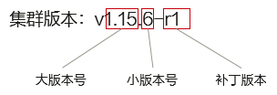

# 版本支持机制

本节为您介绍云容器管理平台的 Kubernetes 版本支持机制。

#### 版本号说明

**版本号：**格式为 **x.y.z**，其中 **x.y** 为大版本号，**z** 为小版本号，若版本号后有 **-r** 称为补丁版本，例如 v1.15.6-r1。

说明：

从 Kubernetes 1.21 版本开始，KPanda 将只显示大版本号，如 v1.21。

