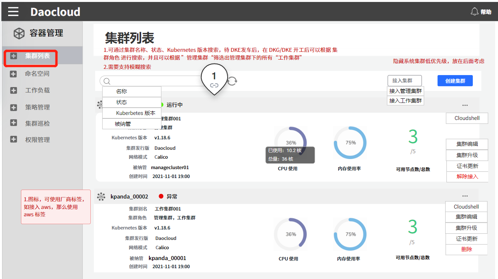
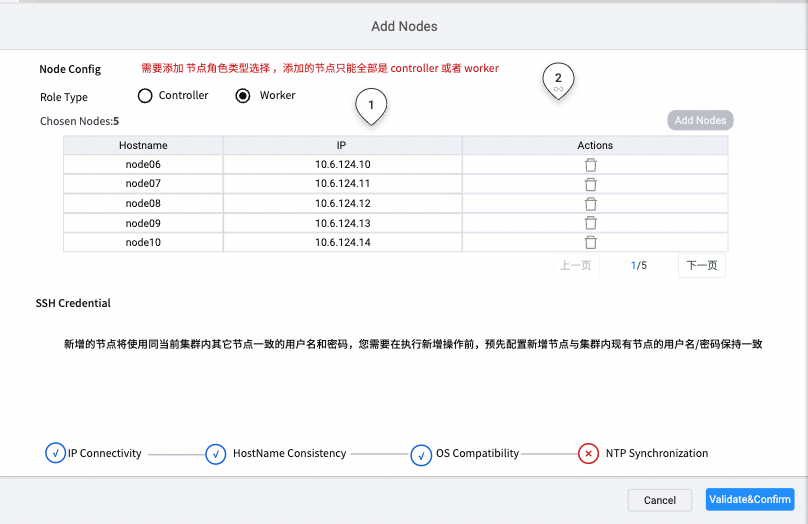

# 集群节点扩容

随着业务应用不断增长，集群资源日趋紧张，这时您可以基于 KubeSpray 对集群节点进行扩容。扩容后，应用可以运行在新增的节点上，缓解资源压力。

**前提条件**

- 容器管理平台[已创建 Kubernetes 集群](https://ndx.gitpages.daocloud.io/engineering/kpanda/zh/07UserGuide/Workloads/CreateDeploymentByImage.html)，并且能够访问集群的 UI 界面。

- 操作用户已获得 `Cluster Admin` 角色授权 ，详情可参考[集群授权](https://ndx.gitpages.daocloud.io/engineering/kpanda/zh/07UserGuide/Workloads/CreateDeploymentByImage.html)。

集群节点扩容的步骤如下：

## 1. 登录平台

`Cluster Admin` 用户根据下表的信息成功登录后，点击左上角的`集群列表`进入`集群列表`页面。

| 参数                   | 说明                                                         | 举例值                   |
| :--------------------- | :----------------------------------------------------------- | :----------------------- |
| UI 账户和密码          | 【类型】必填 【含义】用来登录容器管理平台 Web UI 的管理员账户和密码 | 账户：root 密码：***\*** |
| 容器平台的 Web UI 地址 | 【类型】必填 【含义】容器管理平台的 Web UI 的 IP 地址        | 10.6.124.110             |

## 2. 添加节点

1. 点击一个集群名称，进入`集群详情`。

2. 点击左侧的`节点管理`进入节点列表。

3. 点击右上角`加入节点`

4. 按钮，进入节点添加页面。

   

5. 进入节点添加页面，选择“角色类型”，输入节点名称和节点 IP 信息。可以批量输入。需要确保输入的 Hostname 和 IP 地址没有冲突。

| 参数     | 说明                                                         | 举例值       |
| :------- | :----------------------------------------------------------- | :----------- |
| 角色类型 | 【类型】必填  【含义】选择添加节点的角色类型，可以添加的角色有“控制器节点”、“工作节点”。可以批量添加相同的角色节点。 如添加控制器节点，默认会在添加的节点上启用一个 etcd。 | 工作节点     |
| 节点名称 | 【类型】必填  【含义】节点的 Hostname ，输入前请确认 Hostname 是否正确。 | Node01       |
| IP 地址  | 【类型】必填  【含义】节点的 IP 地址。                  | 10.6.124.110 |

6. 输入上述信息后，点击 `验证`后开始进行节点检测，主要检测项如下：

   1. IP 联通性：自动检测节点 IP 是否联通。
   2. HostName 一致性：检测输入的 HostName 同节点配置是否一致。
   3. OS 兼容性：检测节点的 OS 和所安装的 k8s 版本是否兼容。
   4. NTP 时间同步：检测节点事件同 NTP 时间是否同步。

7. 如上述检测项都已通过，节点会自动添加至集群。整个添加过程大约需要 20 分钟，请耐心等待。如需要查看具体节点添加过程及日志，请查看 [Recently Operations]()。 

**注意**：

1. 可以批量添加控制器节点或工作节点，但不能同时添加控制器节点和工作节点。
2. 基于 Kubespray 的 etcd 和 Controller 部署在相同节点上。扩缩容节点时， Controller 和 etcd 同时进行。
3. 添加 Controller 添加时，需要确保 Controller 节点数为奇数，以防发生脑裂问题。

4. 集群节点缩容时不可下线**第一个控制器** 节点。如果必须执行此操作，请联系售后工程师。

