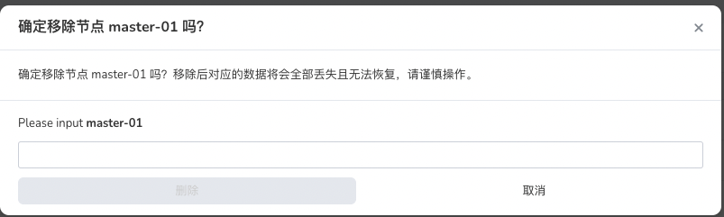

# 集群节点缩容

需要调整集群规模时，可以卸载部分节点。卸载后，应用无法继续运行在此节点上。本章节介绍如何进行集群节点缩容。

**前提条件**

- 容器管理平台[已创建 Kubernetes 集群](https://ndx.gitpages.daocloud.io/engineering/kpanda/zh/07UserGuide/Workloads/CreateDeploymentByImage.html)，并且能够访问集群的 UI 界面。
- 操作用户已获得 `Cluster Admin` 角色授权 ，详情可参考[集群授权](https://ndx.gitpages.daocloud.io/engineering/kpanda/zh/07UserGuide/Workloads/CreateDeploymentByImage.html)。
- 卸载节点之前，需要确认节点已暂停调度，并且此节点上的应用都已驱逐至其他节点。

  - 驱逐方式：登录控制器节点，通过 kubectl drain 命令驱逐节点上所有 Pod 。安全驱逐的方式可以允许容器组里面的容器执行优雅的中止。

删除节点的操作步骤如下：

## 1. 登录平台

`Cluster Admin` 用户根据下表的信息成功登录后，点击左上角的`集群列表`进入`集群列表`页面。

| 参数                   | 说明                                                         | 举例值                   |
| :--------------------- | :----------------------------------------------------------- | :----------------------- |
| UI 账户和密码          | 【类型】必填 【含义】用来登录容器管理平台 Web UI 的管理员账户和密码 | 账户：root 密码：***\*** |
| 容器平台的 Web UI 地址 | 【类型】必填 【含义】容器管理平台的 Web UI 的 IP 地址        | 10.6.124.110             |

### 2. 删除节点

1. 点击一个集群名称，进入`集群详情`。

2. 点击左侧的`节点管理`进入节点列表。

3. 点击列表后的 `...`

4. 选择`移除节点`进入节点移除弹框页面。

   

5. 进入节点卸载页面，输入节点名称，并点击 `确认`进行删除。

   

**注意：**

1. 集群节点缩容时，只能逐个进行卸载，无法批量卸载。

2. 如需卸载集群控制器节点，需要确保最终控制器节点数为**奇数**。 

3. 集群节点缩容时不可下线**第一个控制器** 节点。如果必须执行此操作，请联系售后工程师。
