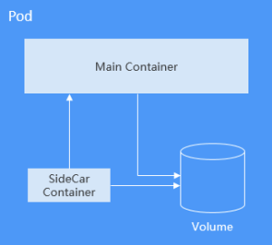

# 容器组 (Pod)

Pod 是 DCE 云原生平台创建或部署的最小单位。一个 Pod 封装一个或多个容器 (container)、存储资源 (volume)、一个独立的网络 IP 以及管理控制容器运行方式的策略选项。

Pod 使用主要分为两种方式：

- Pod 中运行一个容器。这是云原生平台最常见的用法，您可以将 Pod 视为单个封装的容器，但是云原生平台是直接管理 Pod 而不是容器。
- Pod 中运行多个需要耦合在一起工作、需要共享资源的容器。通常这种场景下应用包含一个主容器和几个辅助容器（SideCar Container），如下图所示，例如主容器为一个 web 服务器，从一个固定目录下对外提供文件服务，而辅助容器周期性的从外部下载文件存到这个固定目录下。
  

实际使用中很少直接创建 Pod，而是使用云原生平台中称为 Controller 的抽象层来管理 Pod 实例，例如 Deployment 和 Job。Controller 可以创建和管理多个 Pod，提供副本管理、滚动升级和自愈能力。通常，Controller 会使用 Pod Template 来创建相应的 Pod。

**创建和删除 Pod**

DCE 中资源可以使用 YAML 描述，也可以使用 JSON，如下示例描述了一个名为 nginx 的 Pod，这个 Pod 中包含一个名为 container-0 的容器，使用 nginx:alpine 镜像，使用的资源为 100m core CPU、200Mi 内存。

```yaml
apiVersion: v1 # DCE 的API Version 
kind: Pod # DCE 的资源类型 
metadata:
  name: nginx # Pod 的名称 
spec: # Pod 的具体规格（specification）  
  containers:  
  - image: nginx:alpine # 使用的镜像为 nginx:alpine    
    name: container-0 # 容器的名称    
    resources: # 申请容器所需的资源      
      limits:        
        cpu: 100m        
        memory: 200Mi      
      requests:        
        cpu: 100m        
        memory: 200Mi  
  imagePullSecrets: # 拉取镜像使用的证书  
  - name: default-secret
```

如上述 YAML 代码段中的注释，YAML 描述文件主要为如下部分：

- metadata：一些名称/标签/namespace 等信息。
- spec：Pod 实际的配置信息，包括使用什么镜像、volume 等。

如果去查询云原生平台的资源，您会看到还有一个 status 字段，status 描述云原生平台资源的实际状态，创建时不需要配置。这个示例是一个最小集，其他参数定义后面会逐步介绍。

Pod 定义好后就可以使用 kubectl 创建，如果上面 YAML 文件名称为 nginx.yaml，则创建命令如下所示，-f 表示使用文件方式创建。

```bash
$ kubectl create -f nginx.yaml 
pod/nginx created
```

Pod 创建完成后，可以使用 kubectl get pods 命令查询 Pod 的状态，如下所示。

```bash
$ kubectl get pods 
NAME           READY   STATUS    RESTARTS   AGE 
nginx          1/1     Running   0          40s
```

可以看到此处 nginx 这个 Pod 的状态为 Running，表示正在运行；READY 为 1/1，表示这个 Pod 中有 1 个容器，其中 1 个容器的状态为 Ready。

可以使用 kubectl get 命令查询具体 Pod 的配置信息，如下所示，-o yaml 表示以 YAML 格式返回，还可以使用 -o json，以 JSON 格式返回。

```bash
$ kubectl get pod nginx -o yaml
```

您还可以使用 kubectl describe 命令查看 Pod 的详情。

```bash
$ kubectl describe pod nginx
```

删除 pod 时，DCE 终止 Pod 中所有容器。云原生平台向进程发送 SIGTERM 信号并等待一定的秒数（默认为 30 秒）让容器正常关闭。如果它没有在这个时间内关闭，DCE 会发送一个 SIGKILL 信号杀死该进程。

Pod 的停止与删除有多种方法，例如用以下代码按名称删除。

```bash
$ kubectl delete po nginx 
pod "nginx" deleted
```

同时删除多个 Pod。

```bash
$ kubectl delete po pod1 pod2
```

删除所有 Pod。

```bash
$ kubectl delete po --all 
pod "nginx" deleted
```

根据 Label 删除 Pod。

```bash
$ kubectl delete po -l app=nginx 
pod "nginx" deleted
```

**使用环境变量**

环境变量是容器运行环境中设定的一个变量。

环境变量为应用提供极大的灵活性，您可以在应用程序中使用环境变量，在创建容器时为环境变量赋值，容器运行时读取环境变量的值，从而做到灵活的配置，而不是每次都重新编写应用程序制作镜像。

环境变量的使用方法如下所示，配置 spec.containers.env 字段即可。

```yaml
apiVersion: v1 
kind: Pod 
metadata:  
  name: nginx 
spec:    
    containers:    
    - image: nginx:alpine      
      name: container-0      
      resources:        
        limits:          
          cpu: 100m          
          memory: 200Mi        
        requests:          
          cpu: 100m          
          memory: 200Mi      
      env: # 环境变量      
      - name: env_key        
        value: env_value    
    imagePullSecrets:    
    - name: default-secret
```

执行如下命令查看容器中的环境变量，可以看到 env_key 这个环境变量，其值为 env_value。

```bash
$ kubectl exec -it nginx -- env PATH=/usr/local/sbin:/usr/local/bin:/usr/sbin:/usr/bin:/sbin:/bin
HOSTNAME=nginx 
TERM=xterm 
env_key=env_value
```

环境变量还可以引用 ConfigMap 和 Secret。

**容器启动命令**

启动容器就是启动主进程，但有些时候，启动主进程前，需要一些准备工作。比如 MySQL 类的数据库，可能需要一些数据库配置、初始化的工作，这些工作要在最终的 MySQL 服务器运行之前做完。这些操作，可以在制作镜像时通过在 Dockerfile 文件中设置 ENTRYPOINT 或 CMD 来完成，如下所示的 Dockerfile 中设置了 ENTRYPOINT ["top", "-b"] 命令，其将会在容器启动时执行。

```bash
FROM ubuntu 
ENTRYPOINT ["top", "-b"]
```

实际使用时，只需配置 Pod 的 containers.command 参数，该参数是 list 类型，第一个参数为执行命令，后面均为命令的参数。

```yaml
apiVersion: v1 kind: Pod metadata:  name: nginx spec:  containers:  - image: nginx:alpine    name: container-0    resources:      limits:        cpu: 100m        memory: 200Mi      requests:        cpu: 100m        memory: 200Mi    command:                     # 启动命令    - top    - "-b"  imagePullSecrets:   - name: default-secret
```

**容器的生命周期**

DCE 提供了容器生命周期钩子，在容器的生命周期的特定阶段执行调用，比如容器在停止前希望执行某项操作，就可以注册相应的钩子函数。目前提供的生命周期钩子函数如下所示。

- 启动后处理 (PostStart)：容器启动后触发。
- 停止前处理 (PreStop)：容器停止前触发。

实际使用时，只需配置 Pod 的 lifecycle.postStart 或 lifecycle.preStop 参数，如下所示。

```yaml
apiVersion: v1 kind: Pod metadata:  name: nginx spec:  containers:  - image: nginx:alpine    name: container-0    resources:      limits:        cpu: 100m        memory: 200Mi      requests:        cpu: 100m        memory: 200Mi    lifecycle:      postStart:                 # 启动后处理        exec:          command:          - "/postStart.sh"      preStop:                   # 停止前处理        exec:          command:          - "/preStop.sh"  imagePullSecrets:   - name: default-secret
```

