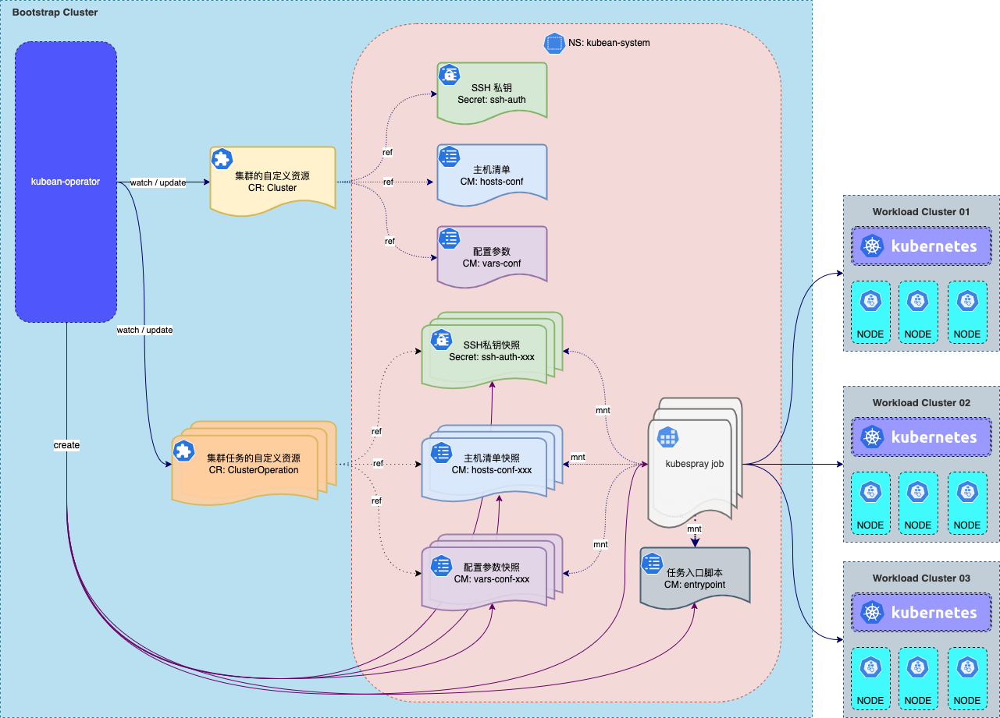
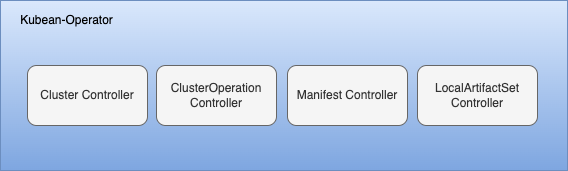

## Kubean 基础架构

> [English](../en/architecture.md) | 中文

Kubean 的整体架构如下所示：

Kubean 需要运行在一个已存在的 Kubernetes 集群，通过应用 Kubean 提供的标准 CRD 资源和 Kubernetes 内建资源来控制和管理集群的生命周期（安装、卸载、升级、扩容、缩容等）。 Kubean 采用 Kubespray 作为底层技术依赖，一方面简化了集群部署的操作流程，降低了用户的使用门槛。另一方面在 Kubespray 能力基础上增加了集群操作记录、离线版本记录等诸多新特性。

 

Kubean 运行着多个控制器，这些控制器跟踪 Kubean CRD 对象的变化，并且与底层集群的 API 服务器进行通信来创建 Kubernetes原生资源对象。由以下四个组件构成：

  1. Cluster Controller: 监视 `Cluster Objects`。唯一标识一个集群，拥有集群节点的访问信息、类型信息、部署参数信息，并且关联所有对此集群的操作（`ClusterOperation Objects`）；
  2. ClusterOperation Controller: 监视 `ClusterOperation Objects`。当 `ClusterOperation Object` 被创建时，控制器会组装一个 [Job](https://kubernetes.io/docs/concepts/workloads/controllers/job/) 去执行 CRD 对象里定义的操作；
  3. Manifest Controller: 监视 `Manifest Objects`。用于记录和维护当前版本的 Kubean 使用和兼容的组件、包及版本；
  4. LocalArtifactSet Controller：监视 `LocalArtifactSet Objects`。用于记录离线包支持的组件及版本信息。
