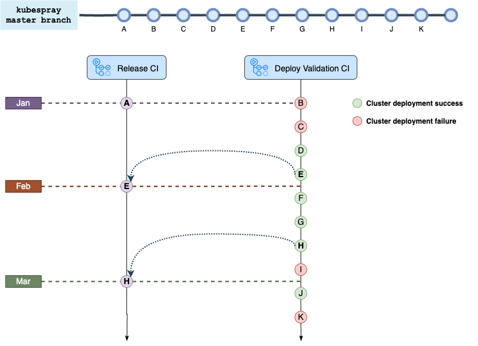

# Release process

This is the process to follow to make a new release. Similar to [Semantic](https://semver.org/) Version. The project
refers to the respective components of this triple as <major>.<minor>.<patch>.

## Three types of release process

* Minor release process, that means a version which have some features , such as `v0.4.0`
* Patch release process, that means a version which includes some bug fix , such as `v0.4.1`
* RC release process, that means a preview version before the official release ,such as `v0.4.2-rc1`

## When to raise a release

- when valuable features are produced by Kubespray/Kubean
- when valuable optimizations are introduced by Kubespray/Kubean
- when valuable bugs are fixed by Kubespray/kubean

## How to release a new version

### Overview

For example, A minor release is e.g. `v0.4.0`.

A minor release requires:

pre steps:

- Check pipeline success
- Raise PR to update the version of kubespray
- smoke test(optional)

core steps:

- push new tag to release
- Smoke test based on new version

post steps:

- Submit an issue of the kubean version update to the [documentation site](https://github.com/DaoCloud/DaoCloud-docs)
- Website updates，blog update
- announce Message at the NDX work WeChat(include the changelog)

### pre steps

#### Check pipeline success



Note: By default, we fix the version of Kubespray at the beginning of each calendar month

Before raise a release for Kubean, we need to ensure whether update the version of Kubespray or not. It depends on whether the upstream brings up something [interesting or important](#When-to-raise-a-release), if so, we need to update it. But before that we should ensure that the new version of Kubespray is stable enough. So we need to check the latest successful [E2E test](https://github.com/kubean-io/kubean/actions/workflows/verify-kubespray.yaml)

#### Raise PR to update the version of kubespray

1. Get the version(commit SHA-1) of kubespray by looking up the latest successful [E2E test](https://github.com/kubean-io/kubean/actions/workflows/verify-kubespray.yaml)
2. Update the version of kubespray in [version.yml](./version.yml)
3. [Raise a PR](https://github.com/kubean-io/kubean/compare) and merge it

### core steps

#### Push the new tag

```bash
git pull origin main ## make local index up to date
new_tag=v0.4.0 ## for example
git tag $new_tag
git push origin $new_tag 
```

if a tag is pushed, the following steps will automatically run:

1. build the images with the new tag ,and then push to ghcr.io
2. build the file artifacts ,such as os-pkgs and images-amd64.tar.gz
3. push a new version helm charts to [kubean-helm-chart](https://github.com/kubean-io/kubean-helm-chart)
4. generate [a release note](https://github.com/kubean-io/kubean/releases) which includes `What's Changed` which shows
   the previous pull requests
   and `New Contributors`
5. push the kubean client library to [kubean-api](https://github.com/kubean-io/kubean-api)

#### Smoke test based on new version

1. create a new k8s cluster by minikube or kind
2. use helm charts to install the new version kubean

# How to check release notes

Go to the [site](https://kubean-io.github.io/website/zh/00Releases/) to check more documents.